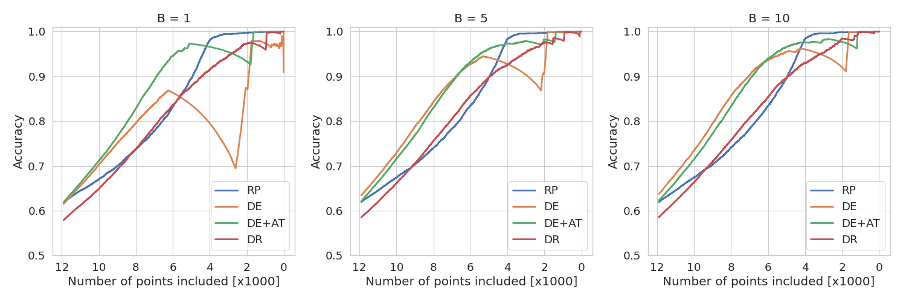
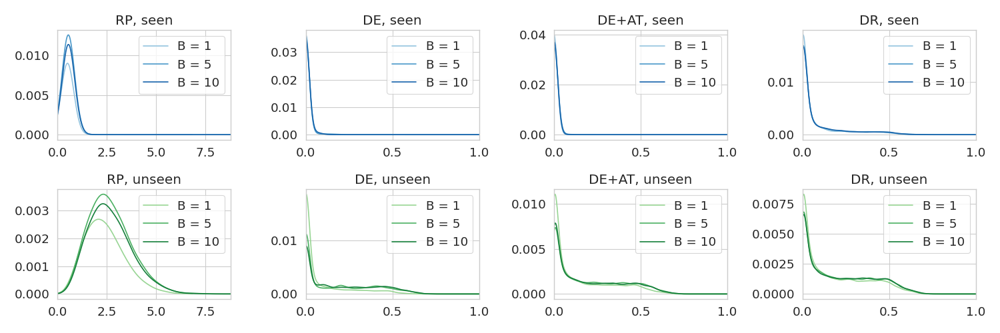
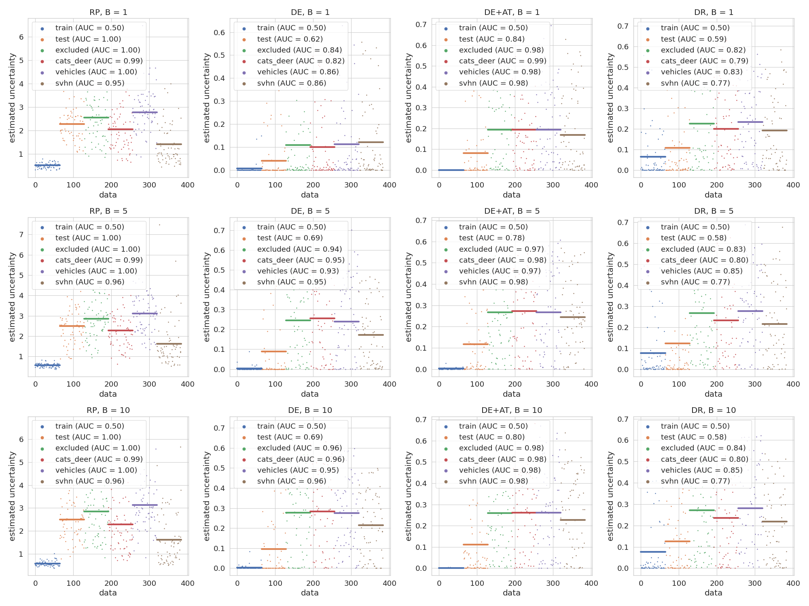

This repo contains the code for the paper [Conservative Uncertainty Estimation By Fitting Prior Networks](https://openreview.net/forum?id=BJlahxHYDS).

The code requires `Python >= 3.6` and a GPU with `CUDA` and `CuDNN` installed.

To install the reqirements, run
```
pip intall -r requirements.txt
```
from the root directory.

All the scripts are in `src/scripts` and the different uncertainty models are in `src/scripts/models`.
The CIFAR-10 experiments from the paper can be reproduced by running
```
./reproduce_cifar_experiment.sh
```
from the `src/scripts` directory.
This should take about 16 hours on a single GPU and will produce three figures in the `figures` directory that should look like this:







The different models can be trained using the training script in `src/scripts/train_uncertainties.py`.
The command line options can be shown by running
```
python train_uncertainties.py --help
```

The neural network architectures used in this implementation are adapted from [David Page](https://github.com/davidcpage/cifar10-fast) and the dropout baseline is adapted from [Yarin Gal](https://github.com/davidcpage/cifar10-fast).

If you want to cite this work, please use

```
@inproceedings{
Ciosek2020Conservative,
title={Conservative Uncertainty Estimation By Fitting Prior Networks},
author={Kamil Ciosek and Vincent Fortuin and Ryota Tomioka and Katja Hofmann and Richard Turner},
booktitle={International Conference on Learning Representations},
year={2020},
url={https://openreview.net/forum?id=BJlahxHYDS}
}
```
